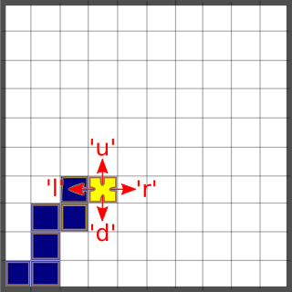
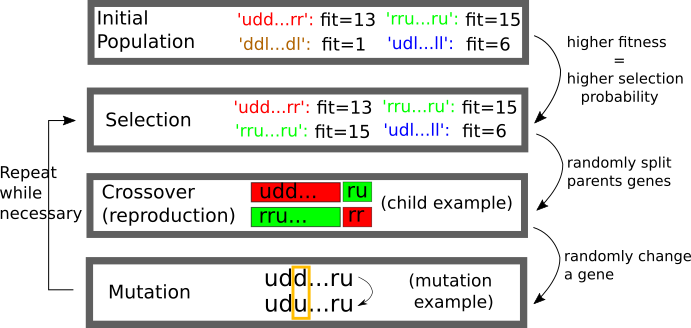
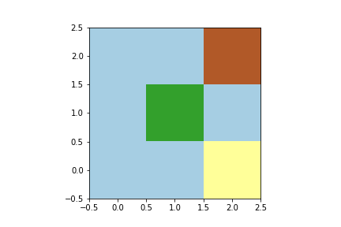
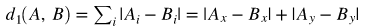
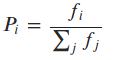
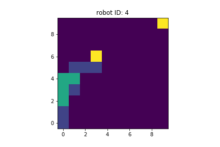
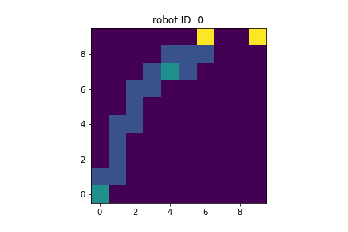
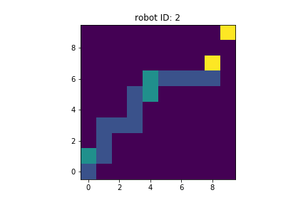
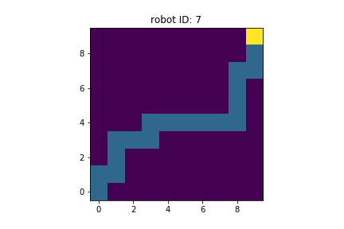
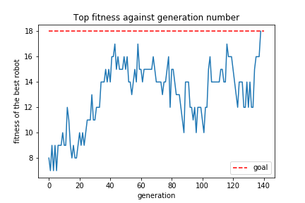

# Pathfinding with virtual robots in a grid using the genetic algorithm

## Summary

We explore the genetic algorithm in the context of a pathfinding problem: *given a virtual robot (at some position (x,y)) capable of receiving instructions ('move up', 'move down',...) to move in a 2D grid, what is the set of instructions we should feed it to make it reach the goal (x', y')? (We do not care if the path is the shortest or not).*   
Pathfinding problems like this are both interesting and useful, but there are many (better) ways to deal with them.
Here we use the problem as a way to explore the genetic algorithm, and to see it in action in a geometrical and intuitive problem. I learned the conceptual framework behind the genetic algorith in [Norvig] (where the authors discuss how to solve the 8-queens problem in chess using this algorithm).

## Main steps of the project

### Our robots and grid
  
Our robots must be at a certain position in the grid at all times, and be able to move up. down, left or right (on each step).  
I use a 10x10 grid, meaning that the maximum number of steps one could possibly need to reach one position from another is (10-1) x 2 = 18.
Accordingly, the set of orders that the a robot must obey will be written as a string of length 18, each character being either 'u', 'd', 'l' or 'r', corresponding to the four directions we want the robot to move in. 

  

(Blue squares are positions where the robot has been in the past; the yellow square is the position for the current iteration).

So I started by defining a Robot class compatible with these requirements.
A robot is an instance of the Robot class.
To define a robot we need to specify an initial grid position (x,y), an ID number for the robot and a string `orders` of length 18 as described above.

But how to evolve our robots?

### The genetic algorithm mimics natural selection:

   1. Start with an *initial population* (of candidates to a solution), each individual having its own set of *genes* (descriptors of the solution proposal);
   2. Determine how *fit* (how close they are to truly providing a solution to the problem) the individuals in the population are;
   3. *Select* the individuals which are going to reproduce using their fitness levels: the fitter, the more likely to reproduce;
   4. Couple the selected individuals in pairs (of *parents*) and generate two *children* for each pair of parents by *crossing over* (mixing) the parents' genes;
   5. Introduce a slight *mutation* in the children genes, so that their genes are not just a mix of their parents' genes, and evolution can occur.
   6. These children are now the new population. Repeat 2. --> 5. until one of the robots solves the problem (has maximum fitness) or we reach our maximum number of iterations.
   
   

  

### Fitness and selection
We have an obvious choice for our fitness score: {max_distance - the distance between the final position of the robot and the goal}, so that the robot closest to the goal has the highest fitness.
It is clear that we do not want to use the Euclidean distance in this project. To see this, consider the image below which represents a miniature (3x3) version of our grid.

  

Goal = brown; X = green, Y = yellow.
Clearly: {Euclidean distance between X and the goal} < {Euclidean distance between Y and the goal}.
So if we chose this distance for out fitness, we would be preferring Y over X, which makes no sense: both are 2 steps away from reaching the goal!
This means that, since the robots move in a grid (in discrete steps and non-diagonally), we need another notion of distance to the goal which does not distinguish between these X and Y.
There is a distance function d1 that provides just that - we'll call it the "grid distance", and is given by: 

  

We can use all our usual intuitions about distance since this function has all the usual properties of distances in R^2 (more rigorously, (R^2, d1) is a metric space [Sutherland], and furthermore our grid can be seen as a subset of R^2).

Having the fitness function, it is straightforward to define the probability Pi of a robot with fitness fi being selected to reproduce based on the fitness scores of the population in a natural way:

  

### Crossover and mutation

For the crossover (reproduction), we take two parent robots and produce two children robots: the first children with the same genes as the first parent up to a cutoff c, and the same genes as the second parent from c onwards; the second children with the same genes as the second parent up to the cutoff c, and the same genes as the first parent from c onwards.

The mutation function is simple: it randomly selects a gene of a child and changes it to one of the four letters 'u', 'd', 'l', 'r'.

### Evolution of the robots:

Implementing the algorithm with initial position (0,0) for all robots and goal=(9,9), it was necessary to use 139 generations (iterations) to find a robot that achieves the goal.
   
   Best robot of generation 20:
   

  

   
   Best robot of generation 40:
   
   

  

   
   Best robot of generation 60:
   
   

  

... Finally, after 79 generations ... :
   
   Best robot of generation 139:
   
   

  

The "bes trobot" of a generation is the one with the highest fitness.
We can visualize how the fitness of the best robot changes accross generations.
   

  

   
   ## References

- [Norvig]: Russell, Stuart J., and Peter Norvig. *Artificial intelligence: a modern approach*. Malaysia; Pearson Education Limited,, 2016.
- [Sutherland]: Sutherland, Wilson A. Introduction to metric and topological spaces. Oxford University Press, 2009.
